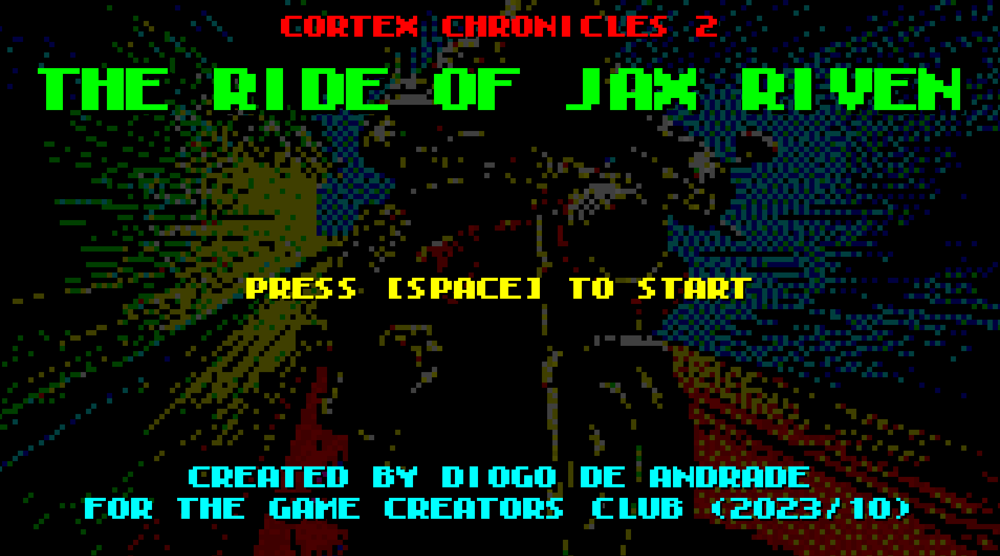
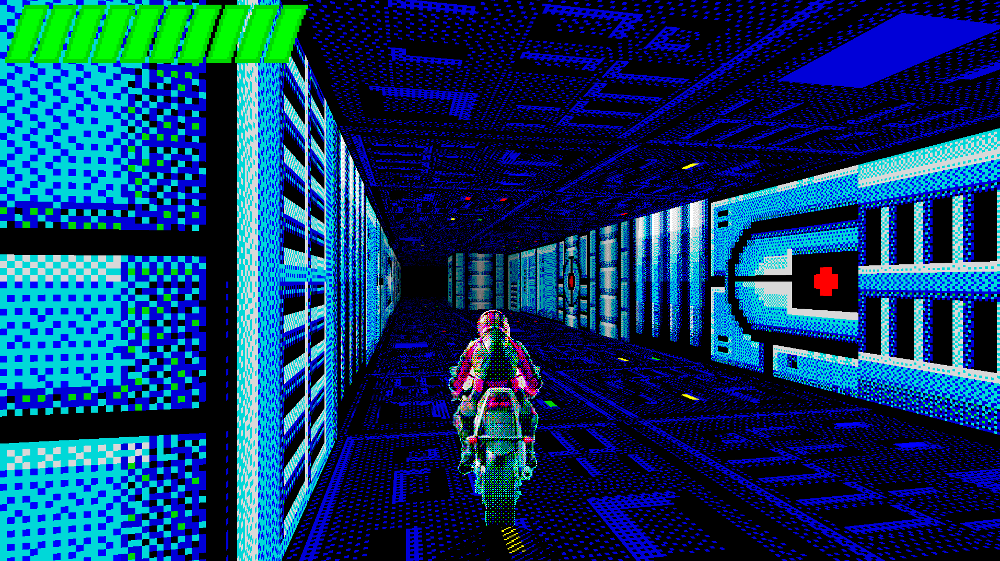

# THE CORTEX CHRONICLES, CHAPTER 2 - The Ride of Jax Riven

Developed for the Game Creator's Club at Lusofona University.
This month, the theme was "Game Engines", so I decided to build a simple game engine for this.

Started with an engine in Rust+OpenGL, but to be honest I wasn't enjoying learning Rust, so I gave up on it and started this game with C#+OpenGL, based on the code I give my students on my 
computer graphics classes.

This is a part of what I hope will be "The Cortex Chronicles" - I want all the games I do for the Game Creator's Club this year to be linked together, hence this idea.
I also want to use a different engine on every entry, so let's see how that goes! :)

The game is a racing game that takes place inside the tunnels below the main city in the game world, in which we play as a D-Boy, a sort of futuristic delivery boy that gets caught in the events of the previous game.
Unfortunately, due to time restrictions, there's almost no gameplay except driving around, it's almost a stupid graphic novel. Maybe one day I'll be able to add some enemies and such in the game.

## Art

Art was done by me (with Midjourney), and then processed in Photoshop to give the high-res ZX-Spectrum look I was looking for.

## Licenses

* All game source code by Diogo de Andrade is licensed under the [MIT] license.
* Tunel art by [mieki256], available through the [CC0] license.
* All remaining art by Diogo de Andrade, available throught the [CC0] license.

## Metadata

* Autor: [Diogo Andrade]

[Diogo Andrade]:https://github.com/DiogoDeAndrade
[Midjourney]:https://www.midjourney.com/home/
[CC0]:https://creativecommons.org/publicdomain/zero/1.0/
[CC-BY 3.0]:https://creativecommons.org/licenses/by/3.0/
[mieki256]:https://opengameart.org/users/mieki256
[MIT]:LICENSE
